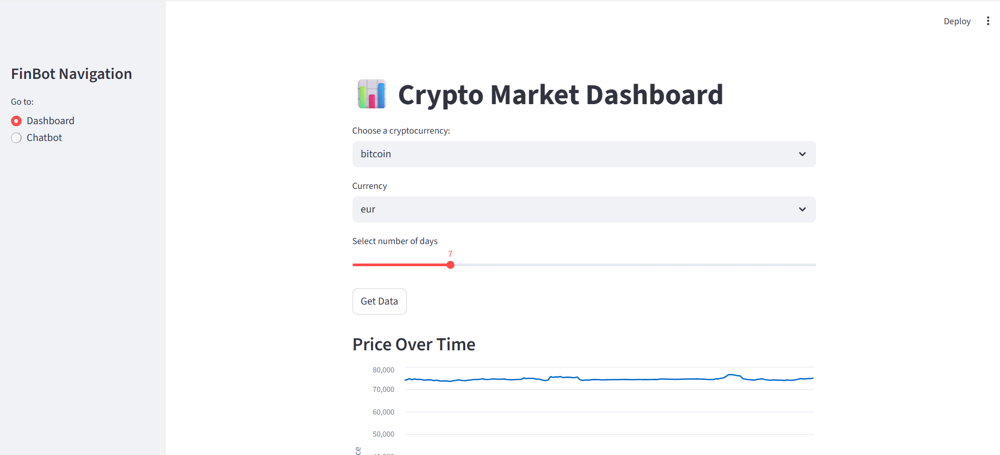
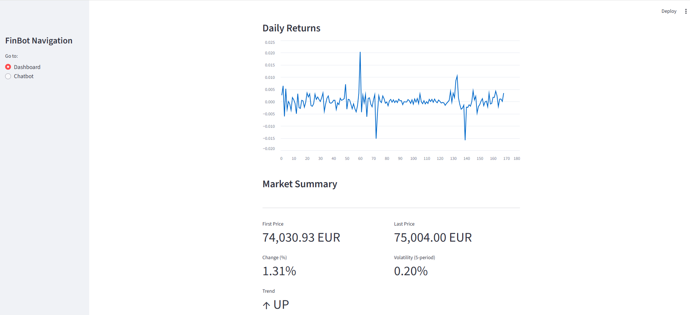
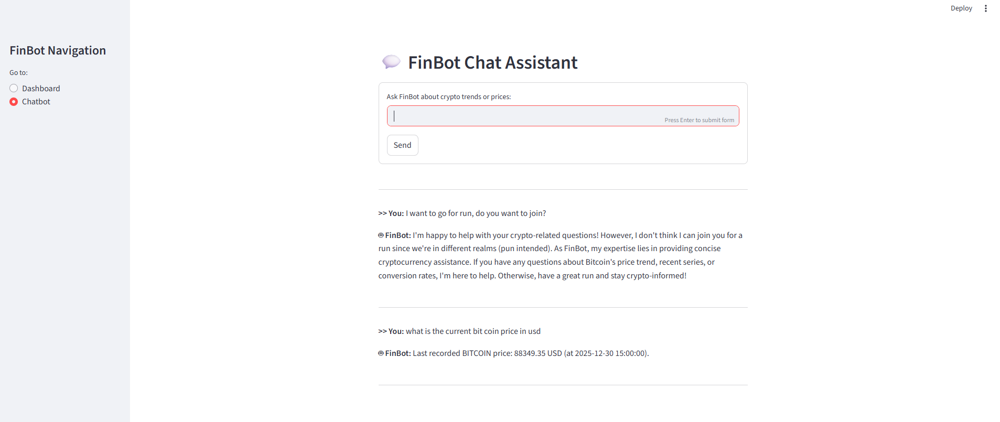

# FinBot – Real-Time Crypto Dashboard + LLM Chat Assistant

**FinBot** is an AI-powered cryptocurrency analytics application that provides real-time price charts, trend indicators and a local LLM-based chatbot capable of answering questions using live market data.

Designed as a full-stack project integrating **FastAPI**, **Streamlit** and **Ollama Llama3**, FinBot demonstrates data engineering, financial analytics, and AI reasoning in a single system.

---

## Features

### 📊 Dashboard
* **Live Crypto Visualization:** 1H resampled price charts.
* **Technical Indicators:** * SMA7 & SMA14 (Simple Moving Averages)
  * Volatility (Rolling Standard Deviation)
  * Percent change tracking
* **Trend Detection:** Automatically flags trends as **UP**, **DOWN**, or **SIDEWAYS**.
* **Multi-Currency Support:** View prices in **USD**, **INR**, or **EUR**.
* **Supported Assets:** Bitcoin, Ethereum, Solana.

### 🤖 Chatbot
* **Powered by Llama3:8B:** Runs locally via Ollama for privacy and zero cost.
* **Natural Language Understanding:**
  * *"What is Bitcoin price in USD?"*
  * *"Trend of Ethereum today?"*
  * *"Convert BTC to INR"*
* **Context Aware:** Automatically extracts coin and currency from user input.
* **Live Data Injection:** Uses real-time market data to formulate responses.
* **Reactive History:** Maintains chat context for follow-up questions.

---

## Tech Stack

| Component | Technology |
| :--- | :--- |
| **Backend API** | FastAPI |
| **Frontend UI** | Streamlit |
| **Data Source** | CoinGecko API |
| **LLM** | Ollama + Llama3:8b |
| **Processing** | Pandas |
| **Environment** | Conda |

---

## Installation & Setup

### 1. Clone Repository
```bash
git clone https://github.com/sanathbn27/FinBot.git
cd FinBot
```

### 2. Create & Activate Environment
Option A: Using Conda (Recommended)
```bash
conda create -n finbot_env python=3.10 -y
conda activate finbot
```
### 3. Install Dependencies
```bash
cd Finbot
pip install -r requirements.txt
```

### 4. Install Ollama & Model

If you want to set up and run the local LLM (Ollama + Llama3), follow the guide below:

[LLM Setup Instructions](./LLM_setup.md)


## Run Application

Step 1: Start Backend Server
Open a terminal and navigate to the backend folder:

```bash
cd backend
uvicorn app.main:app --reload
```

The Backend API will run at: http://localhost:8000

Step 2: Start Streamlit Frontend
Open a new terminal and navigate to the frontend folder:

```bash
cd frontend
streamlit run streamlit_app.py
```

The UI will open at: http://localhost:8501


## How It Works

1. Streamlit UI sends request to FastAPI

2. FastAPI fetches live price data via CoinGecko

3. Pandas processes time-series and indicators:
```bash
df["return"] = df["price"].pct_change()
df["volatility"] = df["return"].rolling(5).std() * 100
df["SMA7"] = df["price"].rolling(7).mean()
df["SMA14"] = df["price"].rolling(14).mean()
```

4. Trend derived from price slope

### AI Chat Assistance

5. Chat queries interpreted → coin + currency extracted

6. Market data injected into LLM prompt

7. Ollama model generates analysis response


## Why Local LLM?

- Zero recurring API cost

- Works offline

- Custom controllable prompts

- Faster & safer for financial use

### Why responses may feel slow:

- CPU inference (no GPU load)

- Larger context = more tokens = slower

- Bigger model = slower reasoning

### Performance improvements:

- Run with GPU backend

- Reduce prompt size

- Switch to quantized models (Q4_K_M)

- Use caching + RAG


## Screenshots 

### 1. Real-Time Crypto Dashboard


### 2. Real-Time Crypto Dashboard


### 3. Crypto Chatbot with LLM

